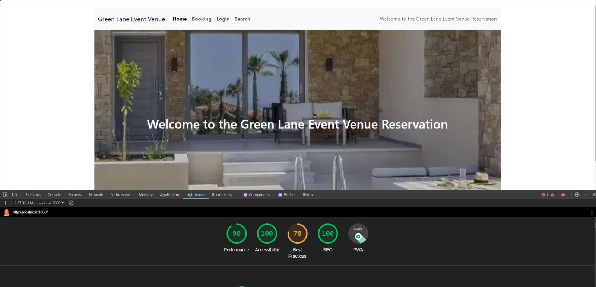

<h1 align="center">Event Venue Reservation</h1>




## Overview

This repository contains the source code for Event Venue Reservation, a web application built with ReactJS for the frontend, Laravel for the backend, MySQL as the database, and Redux for state management.

## Table of Contents

- [Features](#features)
- [Requirements](#requirements)
- [Installation](#installation)
- [Configuration](#configuration)
- [Usage](#usage)
- [Folder Structure](#folder-structure)
- [Dependencies](#dependencies)

## Features

- User is able to book a venue
- User is able to login to update his credentials and see his data
- User is able to logout
- An anonymous person can search for venue with venue, search date and time

## Requirements

- Node.js
- npm
- PHP
- Composer
- MySQL

## Installation

1. Clone the repository:

   ```bash
   git clone https://github.com/ChuksAkah/event-venue-reservation.git
   ```

2. Navigate to the project directory:

   ```bash
   cd event-venue-reservation
   ```

3. Install frontend dependencies:

   ```bash
   cd client
   npm install
   ```

4. Install backend dependencies:

   ```bash
   cd server
   composer install
   ```

## Configuration

### Backend

1. Navigate to the `server` directory:

   ```bash
   cd server
   ```

2. Create a `.env` file and configure the environment variables:

   ```env
   DB_CONNECTION=mysql
   DB_HOST=127.0.0.1
   DB_PORT=3306
   DB_DATABASE=eventvenueusers
   DB_USERNAME=your_database_username
   DB_PASSWORD=your_database_password
   ```
3. Database Migration

   ```bash
   php artisan migrate
   ```

## Usage

1. Start the Laravel development server:

   ```bash
   cd server
   php artisan serve
   ```

2. Start the React development server:

   ```bash
   cd client
   npm start
   ```

3. Open your browser and visit `http://localhost:3000` to view the application.

## Folder Structure

- `client/`: Contains the ReactJS frontend code.
- `server/`: Contains the Laravel backend code.

## Dependencies

- Frontend:

  - ReactJS
  - Redux

- Backend:
  - Laravel
  - MySQL
